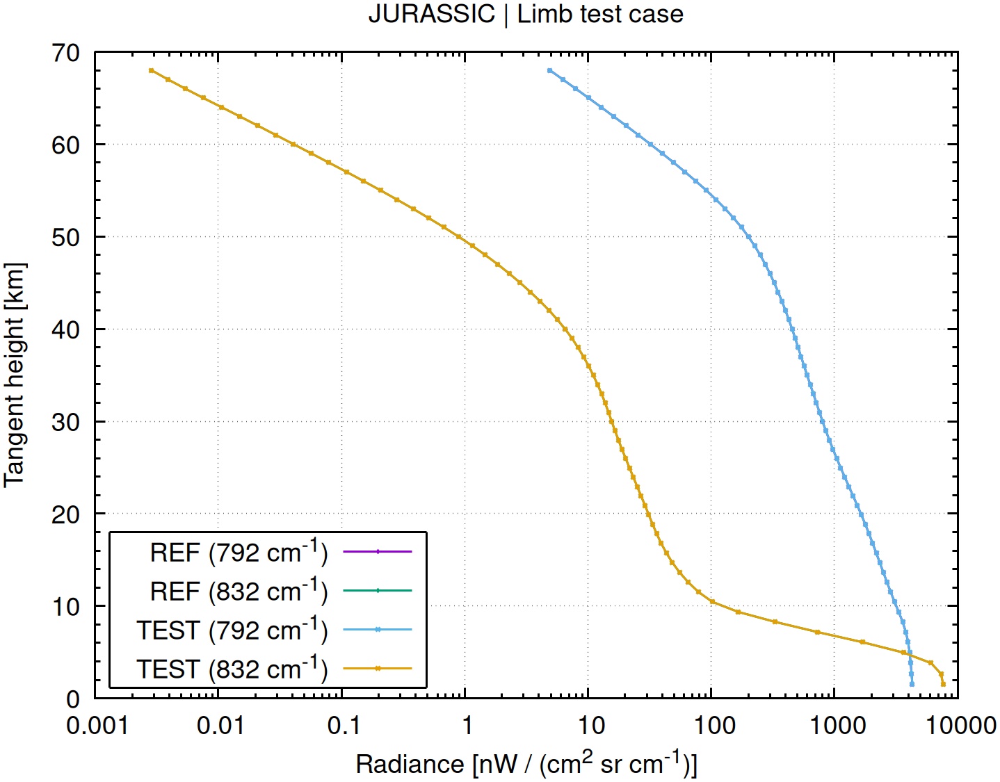
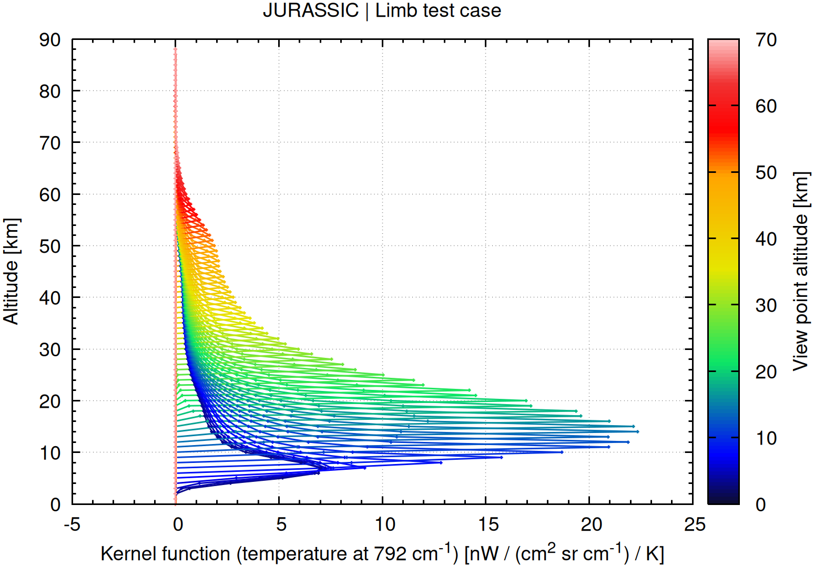
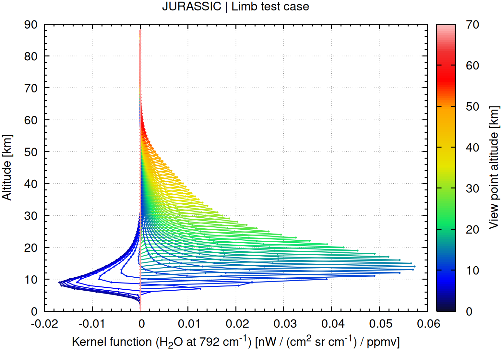

# Juelich Rapid Spectral Simulation Code

The Juelich Rapid Spectral Simulation Code (JURASSIC) is a fast
infrared radiative transfer model for the analysis of atmospheric
remote sensing measurements.

## Introduction

The Jülich Rapid Spectral Simulation Code (JURASSIC) is a radiative
transfer model for simulating infrared radiation in the Earth's
atmosphere. It is designed to provide a balance between computational
efficiency and physical accuracy, making it suitable for a range of
applications in atmospheric and remote sensing research.

JURASSIC applies established spectral approximations together with
precomputed lookup tables derived from detailed line-by-line
calculations to represent gaseous absorption, emission, and
transmission. This approach enables reliable simulations across large
datasets or ensembles without the runtime demands of full line-by-line
models.

Typical use cases include satellite radiance simulations, sensitivity
studies, retrieval algorithm development, and the analysis of
atmospheric composition. With its modular design and support for
high-performance computing environments, JURASSIC offers a practical
tool for studying radiative processes in the middle and upper
atmosphere.

## Features

JURASSIC provides a comprehensive and efficient framework for infrared
radiative transfer simulations, offering key capabilities to support
research, operational, and development workflows:

- **Efficient radiative transfer approximations**: JURASSIC implements
    the Emissivity Growth Approximation (EGA) and the Curtis–Godson
    Approximation (CGA) to model infrared radiative transfer. These
    methods enable rapid yet accurate simulations of atmospheric
    radiances and transmittances across a broad spectral range.

- **High-fidelity spectroscopy via lookup tables**: Band
    transmittances are derived from pre-calculated lookup tables based
    on detailed line-by-line spectroscopy. This approach maintains
    spectroscopic accuracy while largely reducing computational cost,
    making the model suitable for large-scale and near-real-time
    applications.

- **Optimal estimation retrieval framework**: In addition to forward
    modelling, JURASSIC includes an optimal estimation retrieval
    module for inverse modelling of atmospheric state variables. This
    enables the derivation of geophysical parameters such as
    temperature or trace gas volume mixing ratios from observed
    radiances, providing a complete forward–inverse modelling system
    within the same framework.

- **Flexible configuration and modular design**: The model supports
    customizable spectral bands, instrument configurations, and
    atmospheric input fields, allowing users to integrate JURASSIC
    into diverse workflows and existing analysis pipelines.

- **Validated against established reference models**: The model has
    undergone extensive benchmarking and intercomparison studies with
    leading radiative transfer codes such as KOPRA, RFM, and SARTA,
    ensuring reliable performance and scientific credibility across a
    wide range of atmospheric conditions.

- **Hybrid parallelization for HPC environments**: JURASSIC enables
    hybrid MPI–OpenMP parallelization for highly efficient execution
    on multicore CPUs and HPC clusters, enabling the processing of
    large datasets, global simulations, or long time series with
    excellent scalability.

- **Open source and community oriented**: JURASSIC is distributed
    under the GNU General Public License (GPL), fostering
    transparency, collaboration, and community-driven development
    within the atmospheric and remote sensing research community.

## Getting started

### Prerequisites

This documentation describes the installation of JURASSIC on a Linux
system. A number of standard tools (gcc, git, make) and software
libraries are needed to install JURASSIC. The [GNU Scientific
Library](https://www.gnu.org/software/gsl) is required for numerical
calculations. A copy of this library can be found in the git
repository.

### Installation

To install JURASSIC, follow these steps:

**1. Download JURASSIC**

Get the latest or a previous version from the
[JURASSIC releases](https://github.com/slcs-jsc/jurassic/releases) page. After
downloading, extract the release file:

    unzip jurassic-x.y.zip

Alternatively, to get the latest development version, clone the GitHub repository:

    git clone https://github.com/slcs-jsc/jurassic.git

**2. Install required libraries**

The JURASSIC git repository includes a copy of the GNU GSL library
that can be compiled and installed using a build script:

    cd [jurassic_directory]/libs
    ./build.sh -a

Alternatively, if you prefer to use existing system libraries, install
the dependencies manually.

**3. Configure the Makefile**

Navigate to the source directory and adjust the `Makefile` as needed:

    cd [jurassic_directory]/src
    emacs Makefile

Pay special attention to the following settings:

* Edit the `LIBDIR` and `INCDIR` paths to point to the directories
  where the necessary libraries are located on your system.

* By default, the JURASSIC binaries are linked dynamically. Ensure
  that the `LD_LIBRARY_PATH` is properly configured to include the
  paths to the shared libraries. If you prefer static linking, you can
  enable it by setting the `STATIC` flag, which allows you to copy and
  use the binaries on other machines. However, in some cases, either
  static or dynamic linking may not be feasible or could cause
  specific issues.

**4. Compile and test the installation**

Once the Makefile is configured, compile the code using:

    make [-j]

To verify the installation, run the test suite:

    make check

This will execute a series of tests sequentially. If any test fails,
check the log messages for further details.

### Run the examples

JURASSIC provides a project directory for testing the examples and
also to store other experiments:

    cd [jurassic_directory]/projects

This shows how to run the example for the nadir sounder:

    cd nadir ./run.sh

This shows how to run the example for the limb sounder:

    cd ../limb ./run.sh

In both examples, we generate an observation geometry file,

    cat obs.tab

a standard atmosphere for mid-latitudes,

    cat atm.tab

and conduct radiative transfer calculations for two or three detector
channels:

    cat rad.tab

The output of the simulation is verified by comparing it to reference
data.  Additionally, gnuplot is used to create plots of the radiance
data:

  
  &emsp;
  

Kernel functions are calculated using a finite difference method:

  
  &emsp;
  

  
  &emsp;
  

## Further information

More detailed information for new users and developers of JURASSIC is
collected in the [GitHub wiki](https://github.com/slcs-jsc/jurassic/wiki).

These are the main references for citing the JURASSIC model in
scientific publications:

* Baumeister, P. F. and Hoffmann, L.: Fast infrared radiative transfer
  calculations using graphics processing units: JURASSIC-GPU v2.0,
  Geosci. Model Dev., 15, 1855–1874,
  <https://doi.org/10.5194/gmd-15-1855-2022>, 2022.

* Hoffmann, L., and M. J. Alexander, Retrieval of stratospheric
  temperatures from Atmospheric Infrared Sounder radiance measurements
  for gravity wave studies, J. Geophys. Res., 114, D07105,
  <https://doi.org/10.1029/2008JD011241>, 2009.

* Hoffmann, L., Kaufmann, M., Spang, R., Müller, R., Remedios, J. J.,
  Moore, D. P., Volk, C. M., von Clarmann, T., and Riese, M.: Envisat
  MIPAS measurements of CFC-11: retrieval, validation, and
  climatology, Atmos. Chem. Phys., 8, 3671-3688,
  <https://doi.org/10.5194/acp-8-3671-2008>, 2008.

* You can cite the source code of JURASSIC by using the DOI
  <https://doi.org/10.5281/zenodo.4572889>. This DOI represents all
  versions, and will always resolve to the latest one. Specific DOIs
  for each release of JURASSIC can be found on the zenodo web site.

Please see the [citation file](https://github.com/slcs-jsc/jurassic/blob/master/CITATION.cff)
for further information.

## Contributing

We are interested in sharing JURASSIC for operational or research
applications. Please do not hesitate to contact us, if you have any
further questions or need support.

## License

JURASSIC is distributed under the
[GNU General Public License v3.0](https://github.com/slcs-jsc/jurassic/blob/master/COPYING).

## Contact

Dr. Lars Hoffmann

Jülich Supercomputing Centre, Forschungszentrum Jülich

e-mail: <l.hoffmann@fz-juelich.de>
